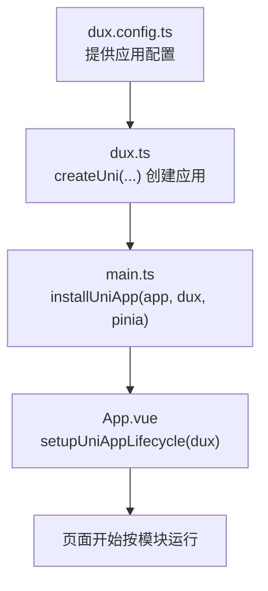
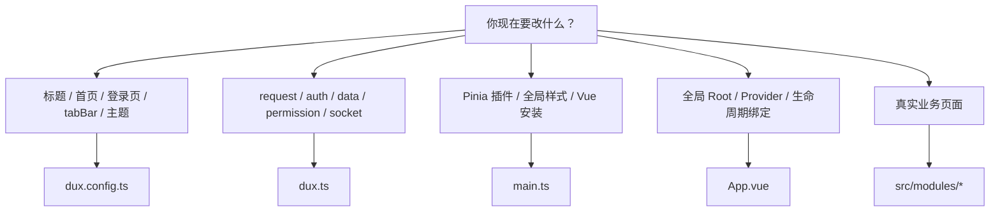

# 应用生命周期

启动时可以先记住一句话：

```text
main.ts      => 安装
App.vue      => 生命周期绑定
dux.ts       => 创建应用
dux.config.ts=> 配置应用
```

## 我应该改哪个文件

```text
应用标题、首页、登录页、tabBar、主题 => dux.config.ts
request、authProvider、dataProvider    => dux.ts
Pinia 插件、全局样式、Vue 安装         => main.ts
全局 Root、全局 Provider               => App.vue
真实业务页面                           => src/modules/*/pages
```

## 启动流程图



## 改动定位图



## main.ts

```ts
import { createSSRApp } from 'vue'
import { createPinia } from 'pinia'
import App from './App.vue'
import { installUniApp } from '@duxweb/uni'
import { dux } from './dux'

export function createApp() {
  const app = createSSRApp(App)
  const pinia = createPinia()

  app.use(pinia) // 安装 Pinia
  installUniApp(app, dux, pinia) // 安装 Dux Uni runtime

  return {
    app,
  }
}
```

这里主要做：

- 创建 Vue app
- 创建 Pinia
- 安装插件
- 安装 `Dux Uni`

## App.vue

```vue
<script setup lang="ts">
import { setupUniAppLifecycle } from '@duxweb/uni'
import { dux } from './dux'

setupUniAppLifecycle(dux) // 把 uni-app 生命周期绑定到 dux runtime
</script>
```

这里主要做：

- 绑定 uni-app 生命周期
- 接全局 Root
- 接全局 Provider

## dux.ts

```ts
import { createUni, defineUniConfig } from '@duxweb/uni'

export const dux = createUni(defineUniConfig({
  appName: 'starter',
}))
```

这里主要做：

- 创建应用 runtime
- 接 request / auth / data / socket 等应用级能力

## dux.config.ts

```ts
import { defineDuxConfig } from '@duxweb/uni'

export default defineDuxConfig({
  app: {
    name: 'starter',
    title: 'Dux Uni Starter',
  },
  router: {
    home: 'home.index',
    login: 'auth.login',
    tabBar: ['home', 'feature', 'account'],
  },
})
```

这里主要做：

- 配置应用标题
- 配置首页、登录页、tabBar
- 配置 UI token 和 runtime 默认值

## 一个简单判断

```text
改应用骨架   => dux.config.ts
改应用能力   => dux.ts
改安装逻辑   => main.ts
改全局宿主   => App.vue
改业务页面   => src/modules/*
```

## 下一步

- [初始化配置](/guide/dux-ts)
- [开发应用](/guide/development-flow)
